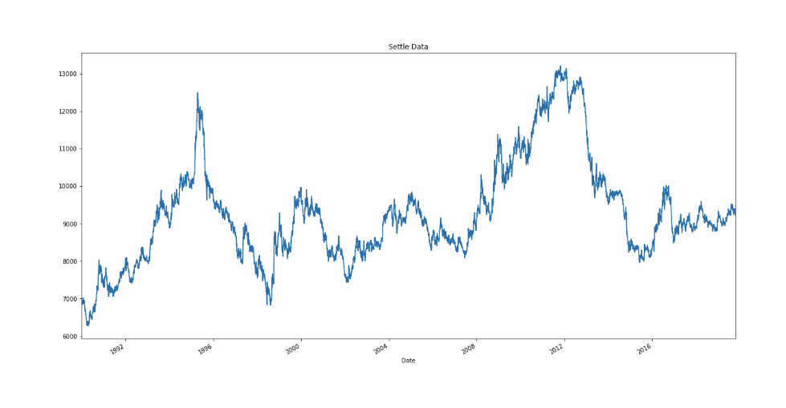
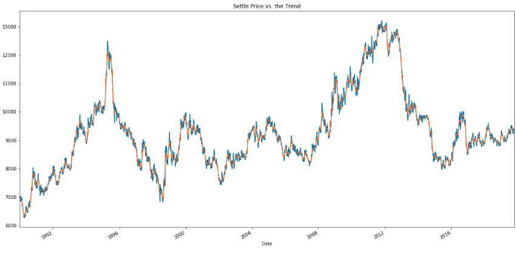
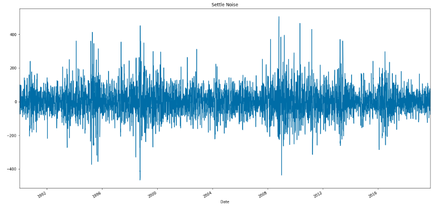
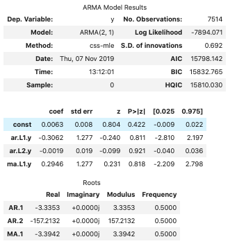
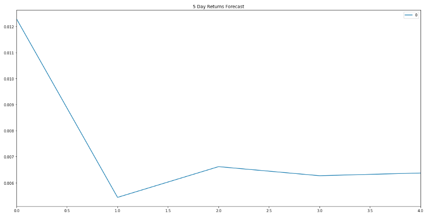
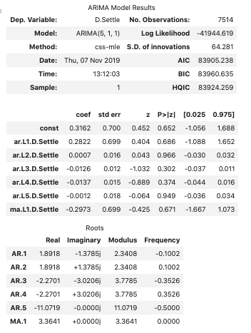
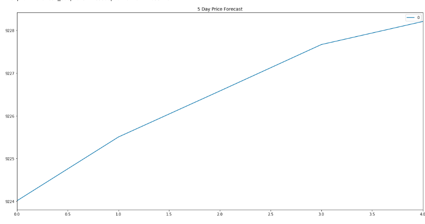
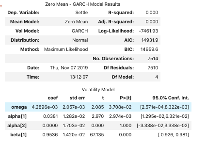
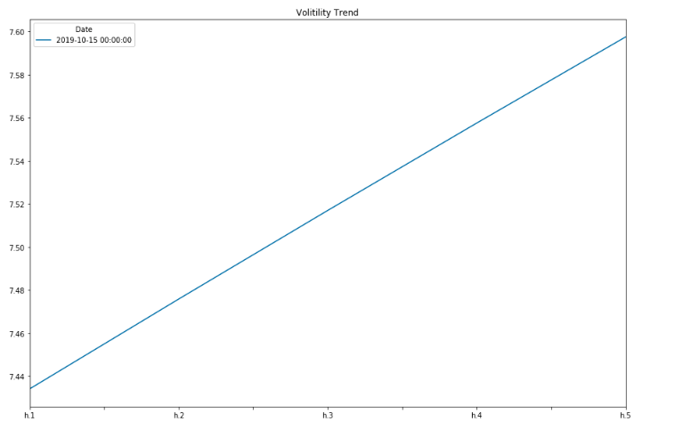
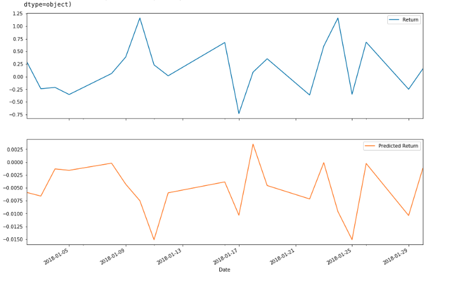

# A Yen for the Future - Challenge

- [Background](#background)
    + [Files](#files)
- [Analysis and Plots :](#analysis-and-plots--)
  * [Time Series Anaylsis:](#time-series-anaylsis-)
      - [Return Forecasting: Initial Time-Series Plotting¶](#return-forecasting--initial-time-series-plotting-)
      - [Decomposition Using a Hodrick-Prescott Filter](#decomposition-using-a-hodrick-prescott-filter)
      - [Forecasting Returns using an ARMA Model](#forecasting-returns-using-an-arma-model)
      - [Forecasting the Settle Price using an ARIMA Model](#forecasting-the-settle-price-using-an-arima-model)
      - [Volatility Forecasting with GARCH](#volatility-forecasting-with-garch)
    + [Conclusions](#conclusions)
  * [Regression Analysis: Seasonal Effects with Sklearn Linear Regression](#regression-analysis--seasonal-effects-with-sklearn-linear-regression)
    + [Conclusion](#conclusion)


## Background

The financial departments of large companies often deal with foreign currency transactions while doing international business. As a result, they are always looking for anything that can help them better understand the future direction and risk of various currencies. Hedge funds, too, are keenly interested in anything that will give them a consistent edge in predicting currency movements.

In this assignment, I will test the many time-series tools that I have learned in order to predict future movements in the value of the Japanese yen versus the U.S. dollar.

I gain proficiency in the following tasks:

1. Time Series Forecasting
2. Linear Regression Modeling


### Files

[Time-Series Notebook](Code/time_series_analysis.ipynb)

[Linear Regression Notebook](Code/regression_analysis.ipynb)

[Yen Data CSV File](Code/yen.csv)

- - -

<details><summary>Instructions</summary>

### Instructions

#### Time-Series Forecasting

In this notebook, you will load historical Dollar-Yen exchange rate futures data and apply time series analysis and modeling to determine whether there is any predictable behavior.

Follow the steps outlined in the time-series starter notebook to complete the following:

1. Decomposition using a Hodrick-Prescott Filter (Decompose the Settle price into trend and noise).
2. Forecasting Returns using an ARMA Model.
3. Forecasting the Settle Price using an ARIMA Model.
4. Forecasting Volatility with GARCH.

Use the results of the time series analysis and modeling to answer the following questions:

1. Based on your time series analysis, would you buy the yen now?
2. Is the risk of the yen expected to increase or decrease?
3. Based on the model evaluation, would you feel confident in using these models for trading?


#### Linear Regression Forecasting

In this notebook, you will build a Scikit-Learn linear regression model to predict Yen futures ("settle") returns with *lagged* Yen futures returns and categorical calendar seasonal effects (e.g., day-of-week or week-of-year seasonal effects).

Follow the steps outlined in the regression_analysis starter notebook to complete the following:

1. Data Preparation (Creating Returns and Lagged Returns and splitting the data into training and testing data)
2. Fitting a Linear Regression Model.
3. Making predictions using the 
testing data.
4. Out-of-sample performance.
5. In-sample performance.


Use the results of the linear regression analysis and modeling to answer the following question:

* Does this model perform better or worse on out-of-sample data compared to in-sample data?

- - -

### Hints and Considerations

* Out-of-sample data is data that the model hasn't seen before (Testing data).
* In-sample data is data that the model was trained on (Training data).

- - -

### Submission

* Create Jupyter Notebooks for the analysis and host the notebooks on GitHub.

* Include a Markdown that summarizes your models and findings and include this report in your GitHub repo.

* Submit the link to your GitHub project to Bootcampspot.
</details>

# Analysis and Plots :

## Time Series Anaylsis:

<details><summary>Libraries</summary>

```java
import numpy as np
import pandas as pd
from pathlib import Path
%matplotlib inline
import statsmodels.api as sm
from statsmodels.tsa.arima_model import ARMA
from statsmodels.tsa.arima_model import ARIMA
import statsmodels.api as sm
import arch as arch
from arch import arch_model
```
</details>

#### Return Forecasting: Initial Time-Series Plotting¶
Based on the plot below, we can see a long-term strengthening of the Japanese Yen against the Dollar. There do seem to be some more medium, 1-3 year consistent trends, but on a daily basis, there are a lot of short-term ups and downs.


- - -
#### Decomposition Using a Hodrick-Prescott Filter

Using a Hodrick-Prescott Filter, decompose the Settle price into a trend and noise.


Smoothing with the HP Filter and plotting the resulting trend against the actual futures returns, we can see that there's a lot of short term fluctuations that deviate around this trend. Perhaps these would represent profitable trading opportunities: For example, when the blue line deviates far below the orange, we can see this as a sign that the Yen is temporarily more undervalued than it should be (and, therefore, we'd see this as a short-term buying opportunity)


- - -

#### Forecasting Returns using an ARMA Model
Using futures Settle Returns, estimate an ARMA model

1. ARMA: Create an ARMA model and fit it to the returns data. Note: Set the AR and MA ("p" and "q") parameters to p=2 and q=1: order=(2, 1).
2. Output the ARMA summary table and take note of the p-values of the lags. Based on the p-values, is the model a good fit (p < 0.05)?
3.Plot the 5-day forecast of the forecasted returns (the results forecast from ARMA model)


- Question: Based on the p-value, is the model a good fit?
Answer:
-   AR p-value = .811 > .05 
- MA p-value = .818 > .05 Therfore, the model is a good fit.
- - -

#### Forecasting the Settle Price using an ARIMA Model
1. Using the raw Yen Settle Price, estimate an ARIMA model.
    -  Set P=5, D=1, and Q=1 in the model (e.g., ARIMA(df, order=(5,1,1))
    - P= # of Auto-Regressive Lags, D= # of Differences (this is usually =1), Q= # of Moving Average Lags
3. Output the ARIMA summary table and take note of the p-values of the lags. Based on the p-values, is the model a good fit (p < 0.05)?
4. Construct a 5 day forecast for the Settle Price. What does the model forecast will happen to the Japanese Yen in the near term?





- - -

#### Volatility Forecasting with GARCH
Rather than predicting returns, let's forecast near-term volatility of Japanese Yen futures returns. Being able to accurately predict volatility will be extremely useful if we want to trade in derivatives or quantify our maximum loss.

Using futures Settle Returns, estimate an GARCH model

1. GARCH: Create an GARCH model and fit it to the returns data. Note: Set the parameters to p=2 and q=1: order=(2, 1).
2. Output the GARCH summary table and take note of the p-values of the lags. Based on the p-values, is the model a good fit (p < 0.05)?
3. Plot the 5-day forecast of the volatility.


Covariance estimator: robust


- - -

### Conclusions
- Based on the anlayis above:
    1. The ARIMA model does predict that the price will increase in the near term from 9224 and 9228.
    2. However; the GARH model indicated that is the risk is expected to increase.
    3. The ARIMA, ARMA, and GARH model all fit the p-value test as well I am able to forcesta both price and risk. 

- Thus; the risk tollerance of the portfolio would deteremine my choice. If the portfolio can withstand the potential risk the mdoel does forcast a postive trend or buy. 

- Based on the anlayis above:
    1. The ARIMA model does predict that the price will increase in the near term from 9224 and 9228.
    2. However; the GARH model indicated that is the risk is expected to increase.
    3. The ARIMA, ARMA, and GARH model all fit the p-value test as well I am able to forcesta both price and risk. 
    
- Conclusion:
    - The risk tollerance of the portfolio would deteremine my choice. If the portfolio can withstand the potential risk the mdoel does forcast a postive trend or buy. 
----
## Regression Analysis: Seasonal Effects with Sklearn Linear Regression
Build a SKLearn linear regression model to predict Yen futures ("settle") returns with lagged Yen futures returns.

<details><summary>Libraries</summary>

```java
import numpy as np
import pandas as pd
from pathlib import Path
%matplotlib inline
from sklearn.linear_model import LinearRegression
from sklearn.metrics import mean_squared_error
```
</details>



### Conclusion
- Out-of-Sample Root Mean Squared Error (RMSE): 0.41521640820129047
- Mean Squared Error (MSE):0.17240466563958065

- In-sample Root Mean Squared Error (RMSE): 0.5663352320297497

The out-of-sample RMSE is lower than the in-sample RMSE. RMSE is typically lower for training data, but is higher in this case however only slightly. Thus can be a good predictions that those that were observed from the trainging data. 

- - -

